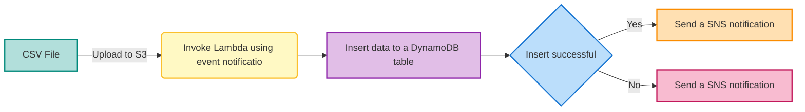

&nbsp;&nbsp;&nbsp;&nbsp;&nbsp;&nbsp;&nbsp;&nbsp;

## Overview

This project implements a serverless architecture to facilitate the real-time loading of data into Amazon DynamoDB from a private S3 bucket. The solution leverages AWS Lambda running inside private subnets within a Virtual Private Cloud (VPC) to ensure secure and scalable data processing

### Loading CSV Files from S3 to DynamoDB with SNS Notification

```mermaid
flowchart LR
%% Nodes
%% A[CSV File] -->|Upload to S3| B(Invoke Lambda using event notification):::green
%% B --> C[Insert data to a DynamoDB table]
%% C --> D{Insert successful}
%% D -->|Yes| E[Send a SNS notification]
%% D -->|No| F[Send a SNS notification]

A["CSV File"]:::green
B("Invoke Lambda using event notificatio"):::yellow
C["Insert data to a DynamoDB table"]:::purple
D{"Insert successful"}:::blue
E["Send a SNS notification"]:::orange
F["Send a SNS notification"]:::pink
%% Edges
A -->|Upload to S3| B
B --> C
C --> D
D -->|Yes| E
D -->|No| F


%% Styling
classDef green fill:#B2DFDB,stroke:#00897B,stroke-width:2px;
classDef orange fill:#FFE0B2,stroke:#FB8C00,stroke-width:2px;
classDef blue fill:#BBDEFB,stroke:#1976D2,stroke-width:2px;
classDef yellow fill:#FFF9C4,stroke:#FBC02D,stroke-width:2px;
classDef pink fill:#F8BBD0,stroke:#C2185B,stroke-width:2px;
classDef purple fill:#E1BEE7,stroke:#8E24AA,stroke-width:2px;
```

### Architecture Description:

This architecture enables the ingestion of CSV files into a DynamoDB table and notifies users about the success or failure of the process via Amazon SNS. Below is a detailed breakdown of the components and workflow:

---

### Workflow Overview
1. **User Upload**:
   - Users upload a CSV file to an **Amazon S3 bucket**.

2. **S3 Event Trigger**:
   - The S3 bucket generates an event notification when a new file is uploaded.
   - This event triggers an **AWS Lambda function**.

3. **Lambda Processing**:
   - The Lambda function processes the uploaded CSV file.
   - The extracted data is validated and stored in **Amazon DynamoDB**.

4. **Error Handling**:
   - If the Lambda function fails to process the file, the event is sent to an **Amazon SQS Dead Letter Queue (DLQ)** for further analysis or reprocessing.

5. **Notifications**:
   - Upon successful or failed processing, the Lambda function sends a notification to users via **Amazon SNS**.
   - SNS distributes the notifications (email, SMS, or other endpoints) to subscribed users.

6. **Monitoring and Logging**:
   - Logs for Lambda execution and failures are captured in **Amazon CloudWatch Logs**.
   - An **Amazon CloudWatch Alarm** monitors the process, ensuring any anomalies (like frequent failures) trigger an alert.

7. **Security**:
   - AWS **KMS (Key Management Service)** ensures encryption for:
     - S3 bucket contents.
     - DynamoDB table data.
     - SNS messages.
     - SQS DLQ messages.

---

### Key Components
1. **Amazon S3**:
   - Acts as the storage layer for CSV files.
   - Configured to trigger Lambda on file upload.

2. **AWS Lambda**:
   - Serverless compute service for processing the CSV file.
   - Handles business logic, validation, and writing data to DynamoDB.

3. **Amazon DynamoDB**:
   - NoSQL database for storing the processed data from the CSV file.

4. **Amazon SNS**:
   - Sends notifications to users regarding the success or failure of the CSV processing.

5. **Amazon SQS (Dead Letter Queue)**:
   - Captures failed events for later debugging or reprocessing.

6. **Amazon CloudWatch**:
   - Logs and monitors Lambda execution and alerts on defined thresholds.

7. **AWS KMS**:
   - Ensures data encryption for all services involved.

---

### Security and Scalability

- **Encryption**: All data at rest and in transit is encrypted using AWS KMS.
- **Scalability**:
  - The architecture is serverless, ensuring it scales automatically based on workload.
  - DynamoDB and S3 handle scaling seamlessly for storage and data access.

---

### User Benefits
- **Real-time Notifications**: Users receive updates on their file processing status.
- **Reliability**: Dead Letter Queue ensures no data is lost even during failures.
- **Security**: Full encryption ensures sensitive data is protected.
- **Ease of Monitoring**: CloudWatch Logs and Alarms enable efficient monitoring and alerting.

This architecture is designed to ensure a seamless and secure workflow for data ingestion and notification.