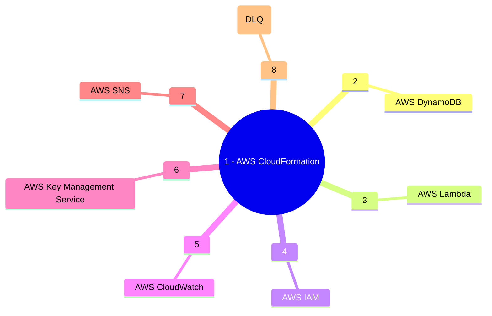

&nbsp;&nbsp;&nbsp;&nbsp;&nbsp;&nbsp;&nbsp;&nbsp;&nbsp;

# Project Tarius: AWS Serverless Real Time Data Load to DynamoDB.

AWS Serverless Real Time Data Load to DynamoDB using Python Lambda and S3 Event Source Mapping and creating the stack using AWS CloudFormation and Language as Python.

## Description

The user / producer uploads a csv source file to the landing zone S3 bucket. A Lambda function is triggered using S3 event notification and loads it to a DynamoDB table. The entire stack is created using CFT (CloudFormation) template. The S3 Bucket, SNS Topic and the DynamoDB table are encrypted using Customer Managed KMS Key. A Cross Stack is used to create the Custom Resource for creating the S3 folder and a Root stack is used to create the remaining services. The Root Stacks launches the Nested Stacks to create the S3 Bucket, SNS Topic, DynamoDB table and CloudWatch Alarms.


### Services Used


### Getting Started

* This repository is configured to deploy the stack in Development, Staging and Production AWS Accounts. To use the pipeline you need to have 
three AWS Accounts created in an AWS Org under a Management Account (which is the best practice). The Org structure will be as follows:

```
Root
├─ Management
├─ Development
├─ Test
└─ Production
```

* Create KMS Key in each of the AWS Accounts which will be used to encrypt the resources.

* Create an OpenID Connect Identity Provider

* Create an IAM Role for OIDC and use the sample Trust Policy in each of the three AWS accounts
```
{
    "Version": "2008-10-17",
    "Statement": [
        {
            "Effect": "Allow",
            "Principal": {
                "Federated": "arn:aws:iam::<Account Id>:oidc-provider/token.actions.githubusercontent.com"
            },
            "Action": "sts:AssumeRoleWithWebIdentity",
            "Condition": {
                "StringLike": {
                    "token.actions.githubusercontent.com:sub": [
                        "repo:<GitHub User>/<GitHub Repository>:ref:refs/head/main",
                    ]
                }
            }
        }
    ]
}
```

  * Create an IAM Policy to allow CloudFormation access and attach it to the OIDC Role, using the sample policy document:
```
{
    "Version": "2012-10-17",
    "Statement": [
        {
            "Effect": "Allow",
            "Action": [
                "cloudformation:CreateStack",
                "cloudformation:DescribeStacks",
                "cloudformation:CreateChangeSet",
                "cloudformation:DescribeChangeSet",
                "cloudformation:DeleteChangeSet",
                "cloudformation:ExecuteChangeSet",
                "cloudformation:DeleteStack",
                "cloudformation:DescribeStackEvents"
            ],
            "Resource": "*"
        }
    ]
}
```

  * Create an IAM Policy to allow creation and deletion of resources  and attach it to the OIDC Role, using the following sample policy document:
```
{
    "Version": "2012-10-17",
    "Statement": [
        {
            "Sid": "AllowS3Access",
            "Effect": "Allow",
            "Action": [
                "s3:PutObject",
                "s3:GetObject",
                "s3:CreateBucket",
                "s3:PutObjectTagging",
                "s3:PutBucketPublicAccessBlock",
                "s3:PutBucketAcl",
                "s3:DeleteObject",
                "s3:DeleteBucket",
                "s3:ListBucket",
                "s3:PutBucketTagging",
                "s3:GetBucketTagging",
                "s3:GetBucketPolicy",
                "s3:GetBucketAcl",
                "s3:GetObjectAcl",
                "s3:GetObjectVersionAcl",
                "s3:PutObjectAcl",
                "s3:PutObjectVersionAcl",
                "s3:GetBucketCORS",
                "s3:PutBucketCORS",
                "s3:GetBucketWebsite",
                "s3:GetBucketVersioning",
                "s3:GetAccelerateConfiguration",
                "s3:GetBucketRequestPayment",
                "s3:GetBucketLogging",
                "s3:GetLifecycleConfiguration",
                "s3:GetReplicationConfiguration",
                "s3:GetEncryptionConfiguration",
                "s3:GetBucketObjectLockConfiguration",
                "s3:GetBucketOwnershipControls",
                "s3:GetObjectTagging",
                "s3:GetBucketNotification",
                "s3:PutEncryptionConfiguration",
                "s3:PutBucketOwnershipControls",
                "s3:PutBucketNotification",
                "s3:ListBucketVersions",
                "s3:PutObjectTagging",
                "s3:PutBucketVersioning",
                "s3:PutLifecycleConfiguration",
                "s3:DeleteObjectVersion",
                "s3:PutBucketPolicy",
                "s3:DeleteBucketPolicy",
                "s3:GetObjectAttributes",
                "s3:GetObjectVersion",
                "s3:GetObjectVersionAttributes",
                "s3:GetObjectVersionTagging"
            ],
            "Resource": "*"
        },
        {
            "Sid": "IAMAccess",
            "Effect": "Allow",
            "Action": [
                "iam:GetRole",
                "iam:CreateRole",
                "iam:DeleteRolePolicy",
                "iam:PutRolePolicy",
                "iam:DeleteRole",
                "iam:PassRole",
                "iam:TagRole",
                "iam:CreatePolicy",
                "iam:ListRolePolicies",
                "iam:GetPolicy",
                "iam:ListAttachedRolePolicies",
                "iam:GetPolicyVersion",
                "iam:ListInstanceProfilesForRole",
                "iam:AttachRolePolicy",
                "iam:DetachRolePolicy",
                "iam:ListPolicyVersions",
                "iam:DeletePolicy",
                "iam:UntagRole",
                "iam:GetRolePolicy"
            ],
            "Resource": "*"
        },
        {
            "Sid": "LambdaCreateAccess",
            "Effect": "Allow",
            "Action": [
                "lambda:GetFunction",
                "lambda:DeleteFunction",
                "lambda:CreateFunction",
                "lambda:TagResource",
                "lambda:InvokeFunction",
                "lambda:PutFunctionConcurrency",
                "lambda:CreateFunction",
                "lambda:ListVersionsByFunction",
                "lambda:GetFunctionCodeSigningConfig",
                "lambda:PutFunctionEventInvokeConfig",
                "lambda:AddPermission",
                "lambda:GetFunctionEventInvokeConfig",
                "lambda:GetPolicy",
                "lambda:DeleteFunctionEventInvokeConfig",
                "lambda:RemovePermission",
                "lambda:ListTags",
                "lambda:UpdateFunctionConfiguration"
            ],
            "Resource": "*"
        },
        {
            "Sid": "SQSCreateAccess",
            "Effect": "Allow",
            "Action": [
                "sqs:GetQueueAttributes",
                "sqs:ListQueueTags",
                "sqs:CreateQueue",
                "sqs:TagQueue",
                "sqs:SetQueueAttributes",
                "sqs:SendMessage",
                "sqs:DeleteQueue"
            ],
            "Resource": "*"
        },
        {
            "Sid": "SNSCreateAccess",
            "Effect": "Allow",
            "Action": [
                "SNS:GetTopicAttributes",
                "SNS:ListTagsForResource",
                "SNS:GetSubscriptionAttributes",
                "SNS:CreateTopic",
                "SNS:TagResource",
                "SNS:SetTopicAttributes",
                "SNS:DeleteTopic",
                "SNS:Subscribe",
                "SNS:Unsubscribe"
            ],
            "Resource": "*"
        },
        {
            "Sid": "DynamoDBAccess",
            "Effect": "Allow",
            "Action": [
                "dynamodb:DescribeTable",
                "dynamodb:DescribeContinuousBackups",
                "dynamodb:DescribeTimeToLive",
                "dynamodb:ListTagsOfResource",
                "dynamodb:CreateTable",
                "dynamodb:TagResource",
                "dynamodb:DeleteTable",
                "dynamodb:PutItem",
                "dynamodb:GetItem",
                "dynamodb:DeleteItem"
            ],
            "Resource": "*"
        },
        {
            "Sid": "KMSKeyAccess",
            "Effect": "Allow",
            "Action": [
                "kms:Encrypt",
                "kms:Decrypt",
                "kms:DescribeKey"
            ],
            "Resource": [
				"arn:aws:kms:<AWS region>:<AWS Account Id>:key/<Customer Managed KMS Key Id>",
				"arn:aws:kms:<AWS region>:<AWS Account Id>:key/<AWS Managed S3 KMS Key Id>"
            ]
        },
        {
            "Sid": "CloudWatchAccess",
            "Effect": "Allow",
            "Action": [
                "cloudwatch:PutMetricAlarm",
                "cloudwatch:DescribeAlarms",
                "cloudwatch:ListTagsForResource",
                "cloudwatch:DeleteAlarms",
                "cloudwatch:TagResource"
            ],
            "Resource": "*"
        },
        {
            "Sid": "StateMachineAccess",
            "Effect": "Allow",
            "Action": [
                "states:CreateStateMachine",
                "states:TagResource",
                "states:DescribeStateMachine",
                "states:DeleteStateMachine"
            ],
            "Resource": "*"
        },
        {
            "Sid": "CWLogGroupAccess",
            "Effect": "Allow",
            "Action": [
                "logs:CreateLogGroup",
                "logs:TagResource",
                "logs:PutRetentionPolicy",
                "logs:DescribeLogGroups",
                "logs:DeleteLogGroup",
                "logs:ListTagsLogGroup",
                "logs:TagLogGroup"
            ],
            "Resource": "*"
        },
        {
            "Sid": "EventBridgeAccess",
            "Effect": "Allow",
            "Action": [
                "events:TagResource",
                "events:CreateEventBus",
                "events:DeleteEventBus",
                "events:PutRule",
                "events:DescribeRule",
                "events:PutTargets",
                "events:RemoveTargets",
                "events:DeleteRule"
            ],
            "Resource": "*"
        },
        {
            "Sid": "SSMParamAccess",
            "Effect": "Allow",
            "Action": [
                "ssm:GetParameters"
            ],
            "Resource": "*"
        },
        {
            "Sid": "EC2Access",
            "Effect": "Allow",
            "Action": [
                "ec2:DescribeImages",
                "ec2:CreateInternetGateway",
                "ec2:CreateVpc",
                "ec2:CreateSubnet",
                "ec2:CreateTags",
                "ec2:CreateRouteTable",
                "ec2:CreateRoute",
                "ec2:CreateSecurityGroup",
                "ec2:DescribeInternetGateways",
                "ec2:DescribeVpcs",
                "ec2:DescribeAccountAttributes",
                "ec2:DescribeRouteTables",
                "ec2:DescribeSubnets",
                "ec2:DescribeAvailabilityZones",
                "ec2:DescribeSecurityGroups",
                "ec2:DeleteVpc",
                "ec2:DeleteSubnet",
                "ec2:DeleteRouteTable",
                "ec2:DeleteRoute",
                "ec2:DeleteSecurityGroup",
                "ec2:DeleteInternetGateway",
                "ec2:ModifyVpcAttribute",
                "ec2:AttachInternetGateway",
                "ec2:DetachInternetGateway",
                "ec2:AssociateRouteTable",
                "ec2:ModifySubnetAttribute",
                "ec2:DisassociateRouteTable",
                "ec2:AuthorizeSecurityGroupIngress",
                "ec2:RunInstances",
                "ec2:TerminateInstances",
                "ec2:DescribeInstances"
            ],
            "Resource": "*"
        },
        {
            "Sid": "Route53Access",
            "Effect": "Allow",
            "Action": [
                "route53:GetHostedZone",
                "route53:GetChange",
                "route53:ChangeResourceRecordSets",
                "route53:ListResourceRecordSets",
                "route53:ListHostedZones"
            ],
            "Resource": "*"
        }
    ]
}
```

* CloudFormation Parameter naming convenstion:
**The following parameters must be present in the CloudFormation Template for the CI/CD pipeline to work:**
    - ProjectName
    - Environment
    - GitHubRef
    - GitHubURL
    - GitHubWFRunNumber
    - GitHubSHA
    - GitHubRepository
    - CiBuild

**Lambda Name and Version Parameter**
    - The lambda function base name parameter should be **[_Some Prefix_]LambdaFunctionBaseName**. The prefix is required if the root template is used to create multiple lambda functions., e.g **ProcessingLambdaFunctionBaseName**
    - For each lambda function name parameter there should be a parameter named as **[_Some Prefix_]LambdaFunctionVersionId**. The prefix should be same as the lambda function name prefix.  Make the parameter as not null and pass some dummy value.The correct version id will be picked bu by the pipeliene.

* Repository Directory Structure
```
tarius-repo/
├─ .git
├─ .github/
│  ├─ workflows/
│  │  ├─ delete-stack.yaml  (**created by the template)
│  │  ├─ deploy-stack.yaml  (**created by the template)
├─ architecture-diagram/
│  ├─ project-architecture-diagram.png
├─ cft/
│  ├─ project-root-stack.yaml
│  ├─ nested-stacks/
│  │  ├─ service1-nested-stack.yaml  (service names are lambda, s3,sns..etc)
│  │  ├─ service2-nested-stack.yaml
│  │  ├─ service3-nested-stack.yaml
├─ src/
│  ├─ lambda-function-base-name.py
├─ data/
│  ├─ data-file.csv (test data)
├─ kms-policy/
│  ├─ kms-key-policy.json (required for documentation purpose only)
├─ params/
│  ├─ cfn-parameters.json
├─ .gitignore
├─ README.md

```

* Create three repository environments in GitHub (devl, test, prod)

* Create the following GitHub repository Secrets:


|Secret Name|Secret Value|
|-|-|
|AWS_REGION|```us-east-1```|
|DEVL_AWS_KMS_KEY_ARN|```arn:aws:kms:<AWS Region>:<Development Account Id>:key/<KMS Key Id in Development>```|
|TEST_AWS_KMS_KEY_ARN|```arn:aws:kms:<AWS Region>:<Test Account Id>:key/<KMS Key Id in Test>```|
|PROD_AWS_KMS_KEY_ARN|```arn:aws:kms:<AWS Region>:<Production Account Id>:key/<KMS Key Id in Production>```|
|DEVL_AWS_ROLE_ARN|```arn:aws:iam::<Development Account Id>:role/<OIDC IAM Role Name>```|
|TEST_AWS_ROLE_ARN|```arn:aws:iam::<Test Account Id>:role/<OIDC IAM Role Name>```|
|PROD_AWS_ROLE_ARN|```arn:aws:iam::<Production Account Id>:role/<OIDC IAM Role Name>```|
|DEVL_CODE_REPOSITORY_S3_BUCKET|```<Repository S3 Bucket in Development>```|
|TEST_CODE_REPOSITORY_S3_BUCKET|```<Repository S3 Bucket in Test>```|
|PROD_CODE_REPOSITORY_S3_BUCKET|```<Repository S3 Bucket in Production>```|

### Executing the CI/CD Pipeline

* Create Create a feature branch and push the code.
* The CI/CD pipeline will create a build and then will deploy the stack to devlopment.
* Once the Stage and Prod deployment are approved (If you have configured with protection rule ) the stack will be reployed in the respective environments

### Executing program

* Upload the sample products.csv file to the landing zone folder of the S3 bucket either using S3 console or CLI
* Step-by-step bullets
```
aws s3 cp products.csv <s3 bucket uri>/data/
```
* Alternatively, the data file can be uploaded to the S3 bucket from AWS Console as well and verify the data in the DynamoDB table.

* To test the SQS Dead Letter Queue, put an exception in the handler after the first logger statement as   
    
```
    now = datetime.now()
    current_time = now.strftime("%H:%M:%S")
    raise Exception(f"{current_time} :: Something bad happened.") 
```
and asynchronously invoke the lambda using the follwing command:
```
aws lambda invoke --invocation-type Event --function-name tarius-process-data-devl-us-east-1 --region us-east-1 --payload '{ "key1": "value1","key2":"value2" }' --cli-binary-format raw-in-base64-out response.json --profile <Profile Name>
```

After 2 failed attempts if the lambda fails for the third time, then the event is pushed into the dead letter queue.

## Help

:email: Subhamay Bhattacharyya  - [subhamay.aws@gmail.com]

## Authors

Contributors names and contact info

Subhamay Bhattacharyya  - [subhamay.aws@gmail.com]

## Version History

* 0.1
    * Initial Release

## License

This project is licensed under Subhamay Bhattacharyya. All Rights Reserved.

## Acknowledgments

